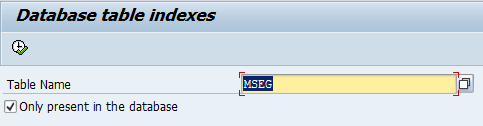
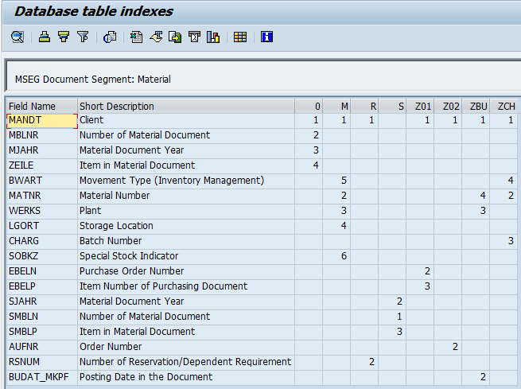

## The program for viewing indexes in the database table
When writing queries to the database, it is desirable to take into account the indexes available in the database, but somehow there was no easy way to see all the database indexes at a time.
I wrote a simple little program - it shows all the indexes of the database table in one ALV table.

To install this on SAP server, use [abapGit](https://docs.abapgit.org/)