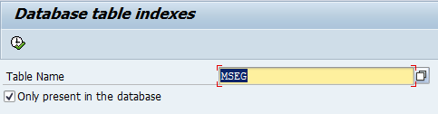

## Программа для просмотра индексов в таблице БД
При написании запросов желательно учитывать имеющиеся в БД индексы, а вот нормального способа посмотреть индексы БД как-то не нашлось, поэтому написал простенькую программку - показывает все индексы таблицы БД в одной ALV табличке.

Для установки этого на SAP сервер используйте [abapGit](https://docs.abapgit.org/)